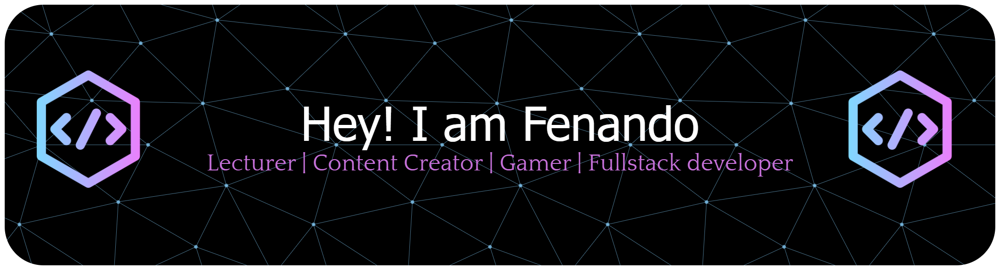

<!-- Banner Header -->

  <b>🎓 Lecturer | 💻 Software Engineer | 📢 Mentor</b> 
  <b>🇮🇩 Palembang, Indonesia</b> 
  <b>UIN Raden Fatah Palembang | BNSP Assessor | Oracle Certified Trainer</b>

---

### 💬 Motto

  <b>✨ Teaching. Motivating. Inspiring. ✨</b> 
  <i>"Bridging Knowledge and Code — Empowering Minds Through Technology."</i>

---

### 🧑‍🏫 About Me
- 🎓 Lecturer at **Information Systems Department, UIN Raden Fatah Palembang**  
- 🧠 Expertise in **Java, C++, PHP, Laravel, CodeIgniter, Flutter, and Oracle Database**  
- 🎬 Passionate about **Multimedia, Digital Content Creation, and Software Engineering**  
- 👮‍♂️ Mentor for **POLDA & POLRESTABES Sumatera Selatan** training programs  
- 💡 Dedicated to guiding students and young developers to become **innovative and ethical tech leaders**  
- 🎮 Gamer in free time — love playing **Mobile Legends, Point Blank, Roblox, PES, and Steam games**  

---

### 💻 Tech Stack & Skills

  

---

### 🏆 Achievements
- 💬 Mentor in **Digital Forensics & Programming Training** for Law Enforcement  
- 🧑‍🏫 Speaker & Educator in **Object-Oriented Programming (OOP)** and Software Design  
- 🎙️ Mentor of **Si Rafa Studio** — a creative team for podcasts & digital content  
- 🏅 Contributor in **academic innovation and digital community empowerment**  

---

### 🎓 Certifications & Professional Roles
- 🧩 **BNSP Certified Assessor** — *Web Developer Competency*  
- 🏫 **Oracle Academy Trainer (ToT Certified)**  
- 🧾 Holder of multiple **Professional Certificates** in Software Engineering & EdTech  
- 🔖 Active in **Curriculum Development & Assessment Standardization** within IT Education  

---

### 📫 Connect With Me

  
  
  
  
  

---

⭐️ *“Keep Learning | Keep Inspiring | Keep Coding”*  

<i>Made with by Mr. Nando</i>

